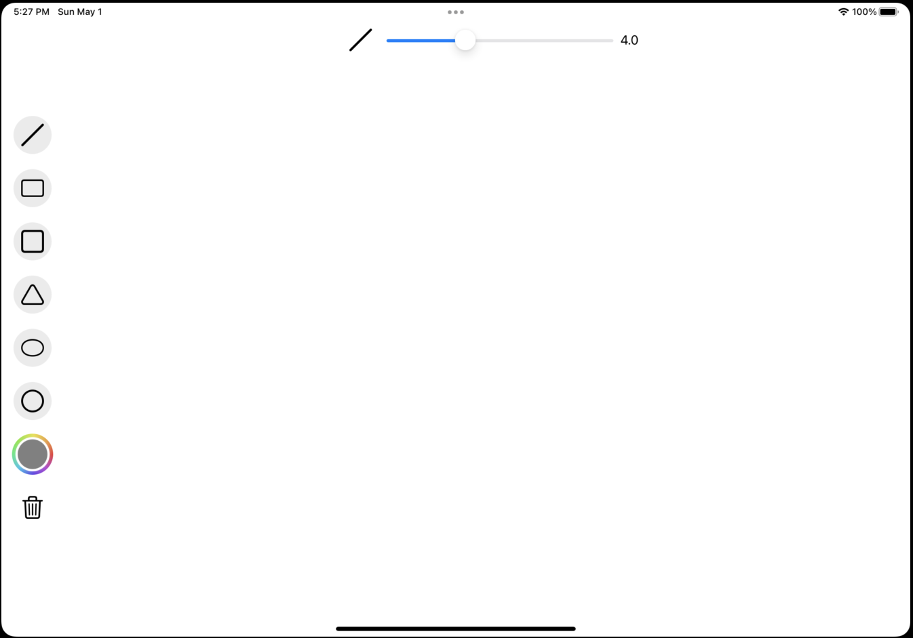
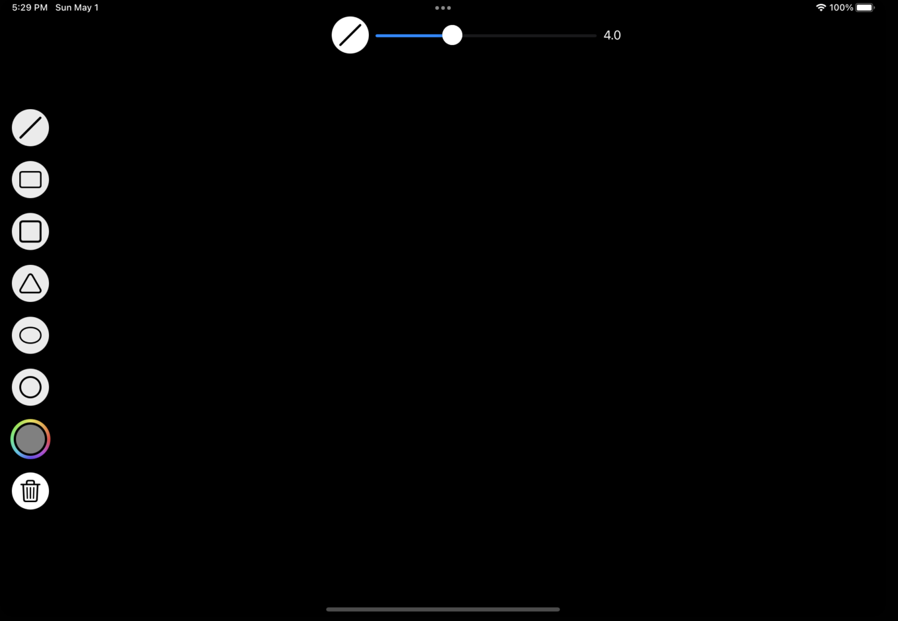

# PaintIOS
Simple paint app for iPad

# Features
- Drawing figures:
  - Line
  - Rectangle
  - Square
  - Triangle
  - Ellipse
  - Circle
- Choosing color of pen
- Choosing width of pen
- Clearing drawing field
- Saving all content

# Implementation
Using canvas with path for drawing figures. Inheritance for figure classes.  
Using JSONEncoder and JSONDecoder for loading and saving content  

# UI
| LightMode | DarkMode |
| --------- | -------- |
| | |
